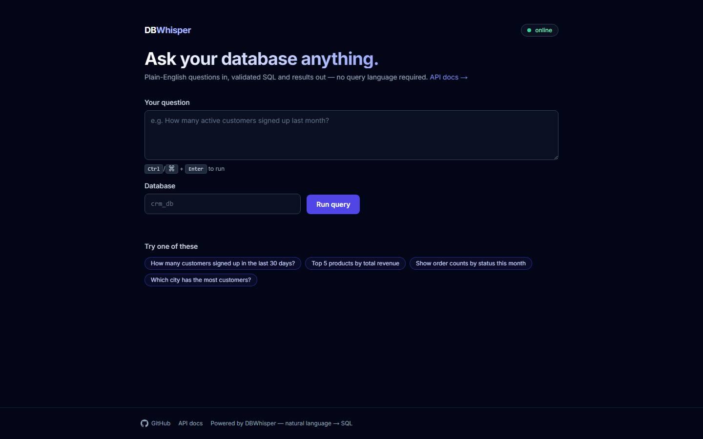
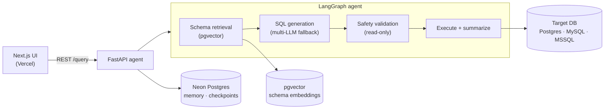

<div align="center">

# 🗄️ DBWhisper

### Ask your database anything — plain English in, **validated SQL + answers** out.

A natural-language-to-SQL **agent** that turns questions into **safe, read-only SQL** across
PostgreSQL / MySQL / SQL Server — powered by a **LangGraph** agent, **schema-aware pgvector
retrieval**, multi-provider LLM fallback, and a hard read-only safety layer.

[](https://dbwhisper.vercel.app)
&nbsp;
[](https://heisenbergblue-dbwhisper.hf.space/docs)


<br/>



</div>

---

## ✨ What it does

Point it at a database, ask in plain English, and DBWhisper **finds the right tables, writes SQL,
proves it's safe, runs it, and explains the answer** — with follow-up suggestions.

- 🧠 **Agentic NL→SQL** — a **LangGraph** pipeline: schema retrieval → SQL generation → validation →
  execution → natural-language summary, with conversation memory for follow-ups.
- 🔎 **Schema-aware retrieval** — databases are enrolled once (schema extracted + AI-documented +
  **embedded into pgvector**); each question runs a **semantic search** to load only the relevant tables.
- 🛡️ **Read-only safety layer** — SELECT-only enforcement (blocks DML/DDL/EXEC, multi-statements,
  and comment injection), read-only DB users, query timeout + row cap.
- 🔁 **Multi-provider LLM fallback** — Gemini, Groq, OpenAI, DeepSeek, Anthropic, OpenRouter —
  automatic failover so one provider outage doesn't take the app down.
- 🗄️ **Multi-database** — PostgreSQL, MySQL, SQL Server (SQLAlchemy + ODBC).
- 📊 **Rich results** — JSON / CSV / table, `describe()` stats, and an LLM summary of the findings.

## 🏗️ Architecture

Split deploy: **Next.js** frontend (Vercel) → **FastAPI** agent (Hugging Face Docker Space) → **Neon Postgres + pgvector**.



```
app/
  main.py            FastAPI app + endpoints (/query, /schemas/enroll, /health, /ready)
  agent/             LangGraph agent — chain · prompts · tools (search, validate, join-path)
  core/              query_executor · sql_validator (read-only) · retriever (pgvector) · formatter
  schema_pipeline/   extract → AI-document → embed a target DB's schema
  security/          read-only checker · log sanitization
db/                  SQLAlchemy models · connection pooling · conversation memory
web/                 Next.js frontend
```

## 🔒 Safety model

The core promise: **it can read your data, never change it.** Every generated query passes a
validator (SELECT-only, no DML/DDL/EXEC, single statement, no comment injection) *before* execution,
connections use **read-only DB users**, and results are timeout- and row-capped. See
[SECURITY.md](SECURITY.md).

## 🛠️ Tech stack

**Agent/Backend:** FastAPI · **LangGraph / LangChain** · SQLAlchemy 2.0 · pgvector · psycopg · pyodbc
**LLMs:** Gemini · Groq · OpenAI · DeepSeek · Anthropic · OpenRouter (fallback chain)
**Frontend:** Next.js · TypeScript · Tailwind
**Infra:** Docker · Neon Postgres · Hugging Face Spaces · Vercel · CI (ruff · pytest · gitleaks)

## 🚀 Quick start

```bash
cp .env.example .env          # add a provider key + POSTGRES_CONNECTION_STRING
uv sync && uv run uvicorn app.main:app --port 8000   # → http://localhost:8000/docs
```

**Optional auth/multi-tenancy** (flag-gated): `USER_AUTH_ENABLED=true` adds Argon2id sessions and
owner-scoped databases. **Embeddings:** hosted Google by default (lean image); `EMBEDDING_PROVIDER=huggingface`
for fully local/offline. **Quality gates:** `uv run ruff check` · `uv run pytest`.

## 📄 License

Personal project by **[Mubin Attar](https://github.com/mubin-attar-007)** · AI/ML Engineer.
