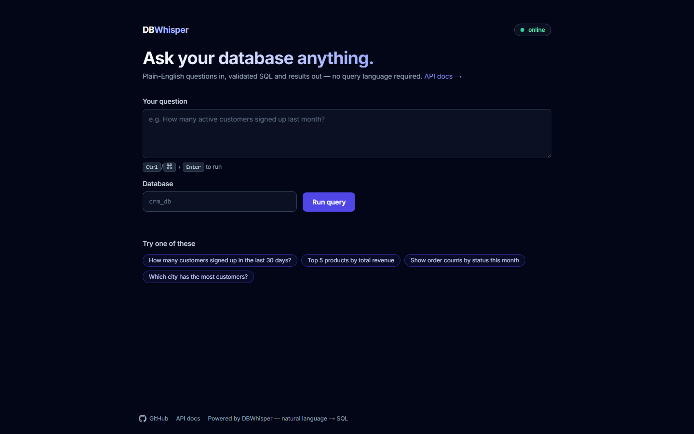
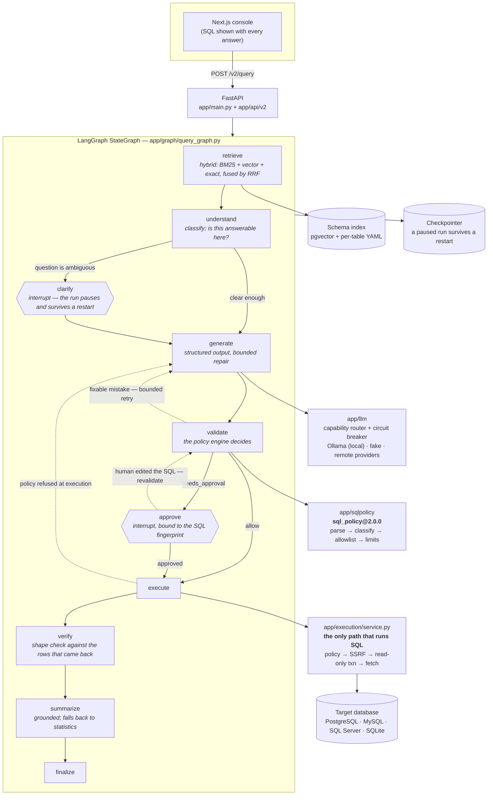

<div align="center">

# DBWhisper

### Ask a database a question in English. Read the SQL before you trust the answer.

A natural-language-to-SQL agent for PostgreSQL, MySQL and SQL Server. One LangGraph state machine
plans the query, an AST policy engine decides whether the statement may run, and a single execution
path runs it inside a rolled-back read-only transaction. It works with no API key and no cloud
account.

[](https://dbwhisper.vercel.app)
&nbsp;
[](https://heisenbergblue-dbwhisper.hf.space/docs)




</div>

---

## The five-minute version

**The problem.** "Just ask the database" products have a trust problem, not a capability problem. A
language model will happily write SQL; the question is what happens between the model emitting a
string and that string reaching your data. If the answer is "we told the model to be careful", the
system is one prompt injection away from a `DELETE`, and one hallucinated column away from a
confidently wrong number.

**The position this project takes.** Safety and correctness are properties of the *code path*, not
of the prompt. So:

- the model never touches the database — it emits SQL, and a **SQLGlot AST policy engine** decides
  whether that SQL is a single read-only `SELECT` before anything runs;
- there is **one execution function** (`app/execution/service.py`) and it re-evaluates policy on
  every call, even when the caller already holds an approval, because a second entrance is how a
  read-only promise quietly stops being true;
- the answer is **grounded**: a verification step checks the summary against the rows that were
  actually returned, and every response carries the SQL, the policy decision and the fingerprint;
- everything runs **locally** if you want it to — Ollama for the model, fastembed on the CPU for
  embeddings, PostgreSQL in a container. No key, no vendor, no data leaving the host.

**Try it without an account, a key, or a cloud:**

```bash
git clone https://github.com/mubin-attar-007/dbwhisper && cd dbwhisper
docker compose --profile core up -d          # postgres + pgvector + api + worker
curl localhost:8000/ready                    # {"ready":true,"checks":{"postgres":true,"pgvector":true}}
```

`docs/LOCAL_SETUP.md` continues from there: a CPU-sized local model, the demo dataset, and a
`MODEL_PROFILE=fake` path that exercises the whole pipeline with no model at all.

---

## Architecture

One FastAPI process, one LangGraph `StateGraph`, one execution path. There is no agent swarm and no
autonomous tool loop: the graph below is the whole control flow, and every edge is code you can read.


```mermaid
flowchart TB
    subgraph CLIENT[" "]
        UI["Next.js console<br/>(SQL shown with every answer)"]
    end

    UI -->|"POST /v2/query"| API["FastAPI<br/>app/main.py + app/api/v2"]

    subgraph GRAPH["LangGraph StateGraph — app/graph/query_graph.py"]
        direction TB
        RET["retrieve<br/><i>hybrid: BM25 + vector + exact, fused by RRF</i>"]
        UND["understand<br/><i>classify; is this answerable here?</i>"]
        CLA{{"clarify<br/><i>interrupt — the run pauses and survives a restart</i>"}}
        GEN["generate<br/><i>structured output, bounded repair</i>"]
        VAL["validate<br/><i>the policy engine decides</i>"]
        APP{{"approve<br/><i>interrupt, bound to the SQL fingerprint</i>"}}
        EXE["execute"]
        VER["verify<br/><i>shape check against the rows that came back</i>"]
        SUM["summarize<br/><i>grounded; falls back to statistics</i>"]
        FIN["finalize"]

        RET --> UND
        UND -->|"question is ambiguous"| CLA
        UND -->|"clear enough"| GEN
        CLA --> GEN
        GEN --> VAL
        VAL -->|"allow"| EXE
        VAL -->|"needs_approval"| APP
        VAL -.->|"fixable mistake — bounded retry"| GEN
        APP -->|"approved"| EXE
        APP -.->|"human edited the SQL — revalidate"| VAL
        EXE --> VER --> SUM --> FIN
        EXE -.->|"policy refused at execution"| GEN
    end

    API --> GRAPH
    RET --> IDX[("Schema index<br/>pgvector + per-table YAML")]
    VAL --> POL["app/sqlpolicy<br/><b>sql_policy@2.0.0</b><br/>parse → classify → allowlist → limits"]
    EXE --> EXEC["app/execution/service.py<br/><b>the only path that runs SQL</b><br/>policy → SSRF → read-only txn → fetch"]
    EXEC --> TGT[("Target database<br/>PostgreSQL · MySQL · SQL Server · SQLite")]
    GEN --> LLM["app/llm<br/>capability router + circuit breaker<br/>Ollama (local) · fake · remote providers"]
    GRAPH --> CKPT[("Checkpointer<br/>a paused run survives a restart")]
```

**Package map** — the modules the diagram names, and what each one owns:

| Path | Responsibility |
|---|---|
| `app/sqlpolicy/` | The AST policy engine. `evaluate(sql, ctx) -> PolicyDecision`. Version `sql_policy@2.0.0`. |
| `app/execution/` | The only code that runs SQL. Per-dialect read-only sessions, row caps, timeouts, error translation. |
| `app/graph/` | The query graph and the investigation subgraph. Typed state, real interrupts, bounded repair. |
| `app/llm/` | Model capabilities, a versioned profile registry, a capability-aware router with a circuit breaker. |
| `app/retrieval/` | Hybrid retrieval: BM25 + vectors + exact match, fused with Reciprocal Rank Fusion, token-budgeted. |
| `app/embeddings/` | fastembed on the CPU by default, a deterministic fake for CI, an optional hosted provider. |
| `app/analysis/` | Deterministic result shape verification, chart selection and a statistics-only summary fallback. |
| `app/platform/` | Application modes, encrypted secrets at rest, SSRF network policy. |
| `app/observability/` | Prometheus metrics with a cardinality guard, OpenTelemetry spans with an attribute allowlist. |
| `app/evaluation/` | The evaluation harness and its datasets, in the repository so a number can be reproduced. |
| `app/jobs/` | The background worker: enrollment, embedding and evaluation as leased jobs. |
| `db/` | Application-database models and Alembic migrations (`alembic upgrade head` at revision `0004`). |
| `web/` | The Next.js console and marketing site. |

A longer, still reader-facing version is in [`docs/ARCHITECTURE.md`](docs/ARCHITECTURE.md); the full
design document is [`docs/v2/TARGET_ARCHITECTURE.md`](docs/v2/TARGET_ARCHITECTURE.md).

---

## How safety actually works

Four independent layers. None of them is sufficient alone, which is the point.

**1. The policy engine decides, the prompt does not.**
`app/sqlpolicy` parses the statement with SQLGlot in the target dialect and works on the AST, not on
keywords. It admits a single read-only `SELECT`/`WITH` and rejects DML, DDL, `GRANT`/`REVOKE`,
`EXEC`, multiple statements, `SELECT … INTO`, system-catalog access (`information_schema`,
`pg_catalog`, `sys.*`), a blocked-function list (file, network, sleep, lock) and references to
tables outside the enrolled scope. It also enforces complexity limits and injects a row limit into
the AST. A third decision exists besides allow and deny — `needs_approval` — and the graph turns it
into a genuine pause.

Its own docstring is the honest framing, and it is repeated here rather than softened: **this is a
structural filter, not a proof.** Its guarantee is bounded by SQLGlot's parse fidelity for each
dialect. A corpus measures the attacks somebody thought to write down.

**2. There is one door.**
Generated SQL, SQL you edited in the UI, an investigation sub-question and an evaluation case all
call `app.execution.service.execute()`. It re-runs policy every time. A caller-supplied decision is
accepted only as an approval token whose fingerprint must match the statement being executed — which
is what stops an approved query from being swapped for a different one after approval.

**3. The database is asked to refuse writes.** Per dialect, and stated per dialect because it varies:

| Engine | Session-level read-only | Mechanism |
|---|---|---|
| PostgreSQL | yes | `SET TRANSACTION READ ONLY` + statement/lock/idle timeouts |
| MySQL / MariaDB | yes | `START TRANSACTION READ ONLY` (+ `MAX_EXECUTION_TIME` where supported) |
| SQLite | yes | `PRAGMA query_only` |
| SQL Server | **no** | no session-level read-only mode exists; the controls there are the policy engine, a least-privilege login and the driver query timeout |

Every connection is rolled back in a `finally` block whatever happened.

**4. The role you configure is still the real control.** Enrollment runs a non-destructive privilege
probe and returns HTTP 400 rather than enrolling a connection that appears writable. The probe is a
backstop, not a substitute: give DBWhisper a `SELECT`-only role.

Around those four: DSNs are encrypted at rest with Fernet (`DBW_SECRET_KEYS`), connection targets
are checked against an SSRF policy before they are dialled, logs and traces are scrubbed by an
attribute allowlist, and the application mode (`demo` / `self_hosted` / `production`) is a single
typed policy object rather than scattered `if` statements. See [`SECURITY.md`](SECURITY.md) and
[`docs/v2/THREAT_MODEL.md`](docs/v2/THREAT_MODEL.md).

---

## How quality is measured

The evaluation harness lives in the repository, at `app/evaluation/`, and runs offline. That is a
deliberate correction: the previous headline numbers came from a harness that was never committed,
so nobody could reproduce them — including us. See `docs/v2/CLAIM_AUDIT.md` §4.4 for the
post-mortem, which is more interesting than the numbers were.

Two things are measured, and they are different kinds of claim.

**The policy corpus** is a deterministic decision function with no model in the loop, so its result
is reproducible to the case:

```bash
uv run pytest tests/sqlpolicy
```

> `app/evaluation/datasets/adversarial/sql_policy_cases.yaml` v2.0.0 — 255 cases expanded across
> PostgreSQL, MySQL, SQL Server and SQLite into 577 case×dialect combinations: 343 expected-deny,
> 210 expected-allow, 24 expected-needs-approval. Engine `sql_policy@2.0.0` on sqlglot 30.17.0.
> No model, no prompt version, no temperature — and no live database: nothing in this corpus is ever
> executed. Counts verified 2026-08-24 on branch `feat/dbwhisper-v2`.

**The pipeline smoke run** exercises the real graph against SQLite fixtures built from the
repository, using an oracle provider that replays reference SQL:

```bash
scripts/eval-smoke.sh        # bash;  scripts/eval-smoke.ps1 on Windows
```

> RAN 2026-08-24, `MODEL_PROFILE=fake EMBEDDING_PROFILE=fake`: 169 cases, **0 unsafe executions**,
> execution accuracy 135 of 135, behaviour 167 of 169. The oracle replays known-good SQL, so this
> measures the pipeline and the policy layer — **it is not a measurement of how well a model writes
> SQL.** For that, run `custom --provider <profile>`, which prints its own provenance block.

`docs/EVALUATION.md` explains both, and explains how to read a provenance block before quoting a
number from one.

---

## Running it

The short version is above. Three paths, all documented in [`docs/LOCAL_SETUP.md`](docs/LOCAL_SETUP.md):

| Path | Command | What you need |
|---|---|---|
| Containers | `docker compose --profile core up -d` | Docker |
| Containers + a local model | `docker compose --profile core --profile local-ai up -d` | Docker, ~2 GB RAM for the small model |
| From source | `uv sync && uv run uvicorn app.main:app --port 8000` | Python 3.13, a PostgreSQL with pgvector |

No API key is required on any of them. `MODEL_PROFILE=fake` runs the whole pipeline deterministically
with no model at all, which is also what CI uses.

Operational procedures — backups, key rotation, migrations, the mode matrix, what to do when a
provider is down, how to read a trace — are in [`docs/OPERATIONS.md`](docs/OPERATIONS.md).

---

## API surface

27 application endpoints (plus FastAPI's own `/docs`, `/redoc`, `/openapi.json` and a static mount).

- **v1** — `POST /query`, `POST /run_sql`, `POST /schemas/enroll`, `POST /schemas/embeddings`,
  `GET /schemas/{db_flag}`, `GET /databases`, the `/training/pairs` verified-query endpoints, the
  `/auth/*` session endpoints, `GET /health`, `GET /ready`, `GET /metrics`.
- **v2** — `POST /v2/query`, `GET /v2/runs/{run_id}`, `POST /v2/runs/{run_id}/resume`,
  `POST /v2/investigate`, `POST /v2/investigations/{run_id}/resume`,
  `POST /v2/connections/{db_flag}/enroll`, `GET /v2/jobs/{job_id}`, `GET /v2/models/health`.

v1 is kept because clients depend on its contract; v2 exists because that contract cannot express a
run that pauses for a human, an approval bound to a fingerprint, or a step-by-step trace.

---

## What did not work, and what it cost

A portfolio README that only lists wins is not evidence of judgement. These are the ones worth knowing.

**The first evaluation harness measured the wrong thing.** Its "fail-closed on unsafe input" score
required a query to be *valid* and *successful* before it could register a failure — so an outage, a
rate-limit or a crash all scored as a pass. In every recorded unsafe case the model had declined at
generation and nothing had ever reached the validator, meaning the run contained zero observations
of the thing it claimed to measure. The number was retired, the harness was rewritten inside the
repository, and `docs/v2/CLAIM_AUDIT.md` §5 now requires a written scoring predicate before a metric
can be published.

**The first prompt was hardcoded to one customer's schema** and was used for every enrolled database.
The contamination is visible inside the run that produced the old accuracy number: it queried a table
that did not exist in the database being measured. Prompts are versioned now, with a retirement date
and a reason.

**An 82% accuracy claim was withdrawn rather than restated.** Four independent reasons, any one
sufficient: the harness was untracked, the endpoint it posted to no longer existed, the prompt had
been deleted, and the scoring collapsed duplicate rows into a set. The honest replacement is the
policy corpus, which a stranger can reproduce.

**Trade-offs still standing, stated rather than hidden:**

- **SQL Server is the weak dialect.** No session-level read-only mode, so it leans on the policy
  engine and the login you configure. That is a real asymmetry, not an averaging problem.
- **Type debt is real.** `mypy app db` reports 200 error lines today. CI gates the four packages that
  are clean and ratchets the total so it can shrink but not grow — a burn-down, not a claim of
  cleanliness.
- **Retrieval has not been benchmarked at scale.** The largest enrolled schema in this repository has
  16 tables. Claims about "hundreds of tables" were deleted rather than softened.
- **The container image is ~920 MB** (measured 2026-08-24). Most of it is the ONNX embedding runtime
  and the Microsoft ODBC driver. Both buy something: no API key, and SQL Server support.
- **`/query` executes without asking.** The policy engine has a `needs_approval` decision and the v2
  graph honours it with a real interrupt, but the v1 endpoint still generates, validates and executes
  in one round trip.

---

## Contributing and quality gates

```bash
uv run ruff check app db tests scripts run.py
uv run ruff format --check app db tests scripts run.py
uv run pytest                      # offline: MODEL_PROFILE=fake, EMBEDDING_PROFILE=fake
uv run mypy app/embeddings app/analysis app/observability db/migrate.py   # the clean set
cd web && npm ci && npm run lint && npm run typecheck && npm test && npm run build
```

CI runs all of the above plus a PostgreSQL integration job (Alembic and pgvector on a real
PostgreSQL, not SQLite), an evaluation smoke gate, gitleaks over full history, bandit, Trivy,
pip-audit and CodeQL. See `.github/workflows/ci.yml` — every step says whether it blocks and why.

Changes to any public claim go through `docs/v2/CLAIM_AUDIT.md` first. Its §1.3 checklist is not
decoration: no absolutes in a safety claim, no percentage without a numerator and a denominator, no
metric without provenance, and no claim about a deployed service in a document that ships in the repo.

## License

MIT. A personal project by **[Mubin Attar](https://github.com/mubin-attar-007)**.
