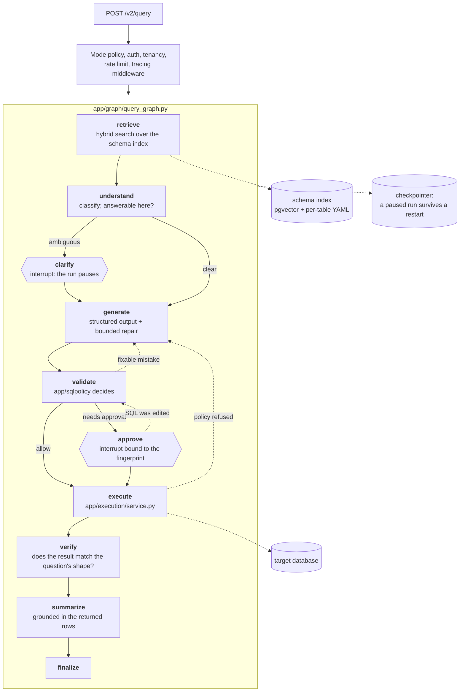

# Architecture

A reader's tour of how DBWhisper is put together and why. It points at real modules — every path
here exists and does what the sentence says. The full design document, including work not yet
landed, is [`docs/v2/TARGET_ARCHITECTURE.md`](v2/TARGET_ARCHITECTURE.md); the security analysis is
[`docs/v2/THREAT_MODEL.md`](v2/THREAT_MODEL.md).

---

## The one-paragraph version

A question arrives over HTTP. Hybrid retrieval finds the handful of tables the question is about. A
LangGraph state machine classifies the question, asks a model for SQL, and hands that SQL to an AST
policy engine that decides whether it may run. If it may, exactly one function executes it inside a
read-only transaction that is rolled back, with a row cap and a statement timeout. The result is
shape-checked and summarised against the rows that actually came back, and the response carries the
SQL, the policy decision and the fingerprint so the answer can be audited rather than believed.

---

## Six decisions that shape everything else

**1. The model never touches the database.** It emits text. Between that text and your data sits
`app/sqlpolicy` (does this parse to a single read-only `SELECT`?) and `app/execution` (the only
function that opens a connection). Every safety property in this system is a property of that path,
which is why none of it depends on the prompt behaving.

**2. One graph, not a swarm of agents.** `app/graph/query_graph.py` is a single LangGraph
`StateGraph` with ten named nodes and explicit conditional edges. Investigation
(`app/graph/investigation.py`) is a *subgraph* that calls the same query graph once per
sub-question, so it inherits the same policy engine rather than reimplementing safety. There is no
free-running loop deciding what to do next.

**3. Deterministic wherever it can be.** Chart selection, result statistics, shape verification, row
limit injection, retrieval fusion and the summary fallback are ordinary code
(`app/analysis/`, `app/retrieval/`). A model is called for the things that genuinely need one:
classification, SQL, and prose. This is what makes an evaluation run repeatable.

**4. No required purchase.** Ollama for the model, fastembed/ONNX on the CPU for embeddings,
PostgreSQL with pgvector, SQLite for fixtures. Every hosted provider is an optional adapter behind
the same interface, and a deterministic **fake** provider is what CI uses so the test suite never
reaches the network.

**5. Evidence, not confidence scores.** A run carries the SQL, the tables consulted, the policy
decision, a fingerprint, truncation state and an evidence checklist. It does not carry a number
between 0 and 1 that nobody can defend.

**6. v1 keeps working.** The v1 routes are reimplemented on the v2 services rather than frozen or
deleted. New capabilities that v1's contract cannot express — a run that pauses, an approval bound to
a fingerprint, a step-by-step trace — live under `/v2/*`.

---

## The request path

Three properties of that picture are worth stating because they were chosen, not inherited:

- **Retrieval runs before understanding.** Classifying a question is much more accurate when the
  model can see which tables exist, and a question about data this database does not hold is caught
  before any generation call is spent on it.
- **Repair re-enters validation.** Corrected SQL is not trusted for having come from a repair; it
  goes through the identical policy path. The loop is bounded, and only *mistakes* are repaired — a
  policy refusal ends the run rather than prompting a retry.
- **The interrupts are real.** `clarify` and `approve` use LangGraph's `interrupt` with a durable
  checkpointer, so a run genuinely pauses, survives a process restart, and resumes through
  `POST /v2/runs/{run_id}/resume` with the human's answer.

---

## The parts

### `app/sqlpolicy/` — the policy engine

`evaluate(sql, PolicyContext) -> PolicyDecision`, version `sql_policy@2.0.0`. Eight stages, each
producing typed `RuleResult` entries recorded on the decision:

1. length and invisible-character checks; parse exactly one statement in the declared dialect;
2. the root statement must be a `SELECT` or a set operation; denied node types anywhere in the tree;
3. blocked functions (file, network, sleep, lock, sequence, configuration introspection);
4. object allowlist — system catalogs, cross-database references, unknown tables, unresolvable
   columns, sensitive columns (deny or require approval);
5. complexity limits for the active policy level;
6. row-limit enforcement in the AST, and optional parameterisation;
7. an independent legacy heuristic layer — the stricter of the two decisions wins;
8. fingerprint and normalised SQL.

Three outcomes, not two: `allow`, `deny`, `needs_approval`. It is a **structural filter, not a
proof**: it decides on the parsed shape of a statement, so its guarantee is bounded by SQLGlot's
parse fidelity per dialect.

### `app/execution/` — the only door

Everything that runs SQL calls `execute()`. In order, before a single row is fetched: policy is
re-evaluated (a caller's decision counts only as an approval token whose fingerprint must match),
the target host is checked against the SSRF policy, a read-only transaction with a statement timeout
is opened and will be rolled back whatever happens, and at most `max_rows + 1` rows are read so
truncation is detected rather than guessed. Driver exceptions are translated before they leave,
because they carry the DSN, the host and the schema.

Read-only *sessions* are enforced by the database on PostgreSQL (`SET TRANSACTION READ ONLY` plus
timeouts), MySQL (`START TRANSACTION READ ONLY`) and SQLite (`PRAGMA query_only`). **SQL Server has
no session-level read-only mode**, so there the controls are the policy engine, a least-privilege
login and the driver timeout. That asymmetry is stated per engine rather than averaged away.

### `app/llm/` — models as capabilities

A model is described by a `ModelProfile`: provider, model id, context window, whether it supports
native JSON schema, and a set of `ModelCapability` values. The router asks for a *capability*
(`SQL_GENERATION`, `STRUCTURED_JSON`, `CLASSIFICATION`, `SUMMARIZATION`, …), not for a vendor, and
holds a circuit breaker per provider so a failing one stops being offered. Failures are normalised
into categories, so a rate-limit is handled differently from a bad key. `structured.py` validates
model output against a schema and repairs it a bounded number of times.

Local profiles (`local-small` / `local-balanced` / `local-quality`, Apache-2.0 Qwen coder models via
Ollama) need no key. Remote profiles activate only when their key is present. `fake` is deterministic
and offline.

### `app/retrieval/` and `app/embeddings/` — finding the right tables

A question does not need a 200-table schema in the prompt; it needs the handful of tables it is
about. `app/retrieval/` builds typed `SearchDocument`s scoped to a `(source, snapshot)` pair and runs
BM25, vector similarity and exact matching, fused with Reciprocal Rank Fusion and an exact-match
boost, then expands along the join graph, promotes parent tables, and packs the result into a token
budget with AI-drafted descriptions labelled as such.

Embeddings are version-stamped so vectors produced by different models cannot be silently mixed. The
default is `BAAI/bge-small-en-v1.5` through fastembed/ONNX — chosen over sentence-transformers
because ONNX Runtime is tens of megabytes where a CUDA-capable PyTorch stack is gigabytes most
deployments never use.

**Not measured at scale.** The largest enrolled schema in this repository has 16 tables. There is no
published benchmark on a large database, and claims about "hundreds of tables" were deleted rather
than softened.

### `app/analysis/` — deterministic answers about answers

`verify_shape()` checks the returned frame against what the question asked for. `choose_chart()`
picks bar or line from column types and cardinality — no model, no pie charts. `deterministic_summary()`
is the fallback when a grounded natural-language summary cannot be produced, so the response degrades
to true statistics instead of to plausible prose.

### `app/platform/` — modes, secrets, network

`AppMode` is `demo | self_hosted | production`, and every behavioural difference lives in one frozen
`AppModePolicy` per mode. Code asks `policy.allow_arbitrary_connections`, never `if mode == ...`, so
one file answers "what does this mode permit". `EgressPolicy` bounds what may leave towards a remote
provider. Secrets are Fernet ciphertext with the key held outside the database, through `MultiFernet`
so rotation is a rolling change. `network_policy.py` checks a connection target before it is dialled.

### `app/observability/` — signals that cannot leak

Two closed vocabularies. Prometheus labels must come from a set bounded by the code: `closed` labels
must be one of a literal set, `bounded` ones admit the first N slug-shaped values and collapse the
rest to `other`, counting the collapse. Span attributes are **dropped unless the key is on an
allowlist** — a denylist fails the moment somebody adds an attribute nobody thought about. Attempts
to attach something forbidden are counted rather than silently ignored, so the mistake surfaces as a
metric.

Quantiles are not computed in-process; the module ships bucket boundaries and Prometheus does the
arithmetic, because a per-process quantile cannot be aggregated across replicas.

### `app/jobs/` — the worker

Deliberately boring: claim a job, run it, record the outcome, sleep. One job at a time per process;
you scale by running more processes. It stops cleanly on SIGTERM — the stage in flight finishes, the
lease is released, the next worker resumes from the following stage. Enrollment and embedding moved
here because they were running synchronously inside an HTTP request.

### `app/evaluation/` — the harness, in the repository

`python -m app.evaluation.cli` with subcommands `build`, `smoke`, `custom`, `safety`, `retrieval`,
`report`, `spider`, `bird`. It lives in the repo — with its fixtures and its datasets — because the
previous harness did not, which is precisely why the numbers it produced had to be withdrawn. See
[`docs/EVALUATION.md`](EVALUATION.md).

---

## Data model and storage

| Store | Contents | Notes |
|---|---|---|
| Application PostgreSQL | `Database_config` (encrypted DSNs), `users`, `user_sessions`, `verified_queries`, `jobs`, conversation memory, graph checkpoints | Alembic-migrated (`db/migrations/`, currently revision `0004`) |
| pgvector | schema-summary embeddings | same database; `/ready` asserts the extension is installed |
| `database_schemas/<flag>/` | per-table YAML catalogue, including AI-drafted descriptions | on disk, not in the database — back it up separately |
| Target databases | your data | read-only; DBWhisper never migrates or writes to them |

---

## The frontend

`web/` is a Next.js App Router application: a marketing page and a console. The browser calls the
console's own origin at `/api/*`, which Next rewrites to `API_PROXY_TARGET` — so CORS is not involved
on the default path, and the site's CSP pins `connect-src 'self'`. Results render as a sortable
table, an auto-selected chart and a plain-English summary, with the generated SQL shown alongside so
it can be read, edited and re-run through the same policy check.

---

## What this architecture does not do

Stated plainly, because an architecture document that only lists strengths is marketing.

- **It does not prove anything about SQL.** The policy engine is a filter over a parse tree. Pair it
  with a least-privilege role; that is the control that does not depend on a parser.
- **v1 `/query` executes without asking.** The `needs_approval` decision and the approval interrupt
  exist in the v2 graph; the v1 endpoint still generates, validates and executes in one round trip.
- **Retrieval is unbenchmarked at scale**, as above.
- **Type coverage is partial.** `mypy` reports 200 error lines across `app` and `db` today. CI gates
  the packages that are clean and ratchets the total downward.
- **Multi-tenancy is thin.** Ownership exists on enrolled databases, but this is not a
  hardened multi-tenant service and is not described as one.
