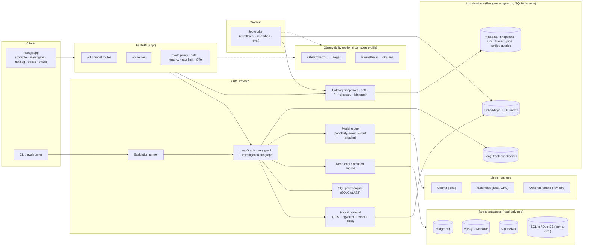
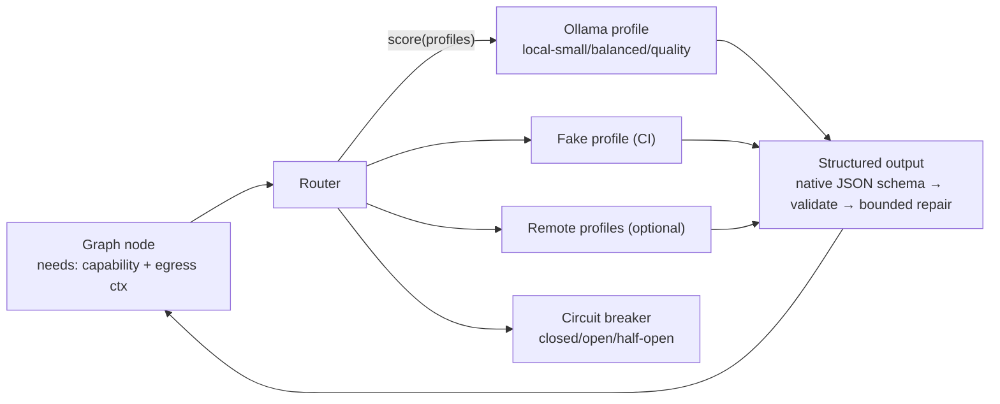
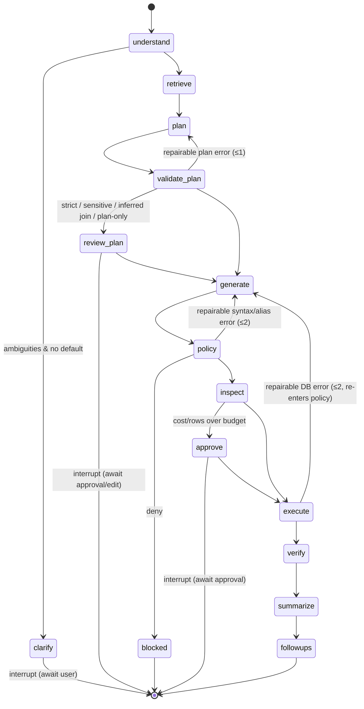

# DBWhisper v2 — Target Architecture

> Status: **design of record** for the `feat/dbwhisper-v2` program (started 2026-08-21).
> Companion documents: [CURRENT_STATE_AUDIT.md](CURRENT_STATE_AUDIT.md) (what exists today),
> [IMPLEMENTATION_ROADMAP.md](IMPLEMENTATION_ROADMAP.md) (how we get there, phase by phase),
> [CLAIM_AUDIT.md](CLAIM_AUDIT.md) (public wording we are allowed to use),
> [DEPENDENCY_AND_LICENSES.md](DEPENDENCY_AND_LICENSES.md) (what we depend on and why).

## 1. Mission in one sentence

An open-source, governed, observable, evaluation-driven AI data analyst that lets users ask questions,
investigate business changes, and obtain evidence-linked answers from relational databases **without
giving the model write access**.

Two principal modes:

| Mode | Input | Output | Pipeline |
|---|---|---|---|
| **Quick Query** | one analytical question | SQL + result + grounded summary + evidence checklist | single pass through the query graph |
| **Investigation** | a broad "why/what changed" question | bounded plan (2–5 sub-questions) → per-question evidence → evidence-linked narrative | investigation subgraph that calls the query graph N times |

## 2. Design principles (and the decision each one forces)

| Principle | Decision |
|---|---|
| **No required purchase** | Local path = Ollama (chat) + fastembed ONNX (embeddings) + Postgres/pgvector + SQLite/DuckDB for demos. Every hosted provider is an *optional adapter*. A deterministic **fake provider** is the default in CI. |
| **Security over convenience** | Target DBs are never the app DB. One execution service (`app/execution`) is the *only* code path that runs generated or user-edited SQL; every path passes AST policy → allowlist → complexity → plan inspection → read-only transaction. Connection secrets are encrypted at rest with a key held outside the DB. |
| **Truthful evidence** | Every answer carries an evidence checklist (not an opaque confidence number). Every eval result carries dataset/n/model/prompt-version/date/exclusions. Public copy is constrained by CLAIM_AUDIT. |
| **No multi-agent theater** | One LangGraph `StateGraph` with typed specialist nodes; investigation is a *subgraph* that re-enters the same query graph. No free-running autonomous agents. |
| **Deterministic where possible** | Chart selection, result statistics, shape verification, limit injection, join-path search, PII heuristics and retrieval fusion are deterministic code, not LLM calls. |
| **Backwards compatible** | v1 routes (`/query`, `/run_sql`, `/databases`, `/training/pairs`, `/schemas/*`, `/auth/*`) keep working and are re-implemented on the v2 services; new capabilities live under `/v2/*`. Persisted data is migrated with Alembic, never dropped. |
| **CI without Postgres** | Retrieval, policy, graph, and API contract tests run against SQLite + an in-memory retrieval index + the fake provider. Postgres/pgvector integration tests are a separate, optional job. |

## 3. System context



## 4. Backend package layout (target)

Existing healthy modules are kept in place; new capabilities are added as packages with narrow public
APIs. Arrows show the only allowed import direction (enforced by an import-linter contract in CI).

```
app/
  main.py                      FastAPI factory: mounts v1 compat + v2 routers, middleware, lifespan
  platform/                    cross-cutting runtime concerns
    modes.py                   AppMode + AppModePolicy (typed; single source of mode behaviour)
    settings.py                pydantic-settings (extends today's core/config.py)
    secrets.py                 authenticated encryption (Fernet/MultiFernet), key rotation
    network_policy.py          SSRF / egress checks for connection targets
    egress_policy.py           data-egress policy enum + enforcement helpers
    audit.py                   append-only audit events
  llm/                         model abstraction (no LangChain types leak past this package)
    types.py                   ModelCapability, ModelProfile, ModelRequest/Response, ProviderHealth...
    registry.py                versioned model/embedding/prompt/policy registries (code-defined)
    router.py                  capability-aware routing, scoring, circuit breaker, fallback reasons
    providers/
      base.py                  ModelProvider protocol
      ollama.py                Ollama + OpenAI-compatible local servers (httpx, no SDK)
      fake.py                  deterministic fixture-backed provider for CI/e2e
      langchain_remote.py      thin adapters for Gemini/Groq/OpenAI/Anthropic/DeepSeek/OpenRouter (optional)
    structured.py              JSON-schema structured output with validate → bounded repair
    prompts/                   versioned prompt templates (python modules, hashed)
  embeddings/
    base.py                    EmbeddingProvider protocol (+ version metadata)
    fastembed_provider.py      CPU ONNX embeddings (default local)
    google_provider.py         optional hosted
    fake.py                    deterministic hash embeddings for CI
    rerank.py                  optional local reranker (measured before enabling)
  catalog/                     what we know about a data source
    models.py                  SQLAlchemy: DataSource, SchemaSnapshot, Table, Column, Relationship,
                               ColumnClassification, GlossaryTerm, Metric, SemanticVersion
    introspect.py              dialect-agnostic extraction (today's SQLAlchemy inspector path, extended)
    fingerprint.py             schema fingerprint + drift diff
    pii.py                     deterministic classification heuristics + review workflow
    glossary.py                semantic layer CRUD + approval
    join_graph.py              declared/approved relationship graph, shortest valid join paths
    documents.py               search-document construction (deterministic first, AI draft optional)
  retrieval/
    base.py                    RetrievalIndex protocol (index / lexical / vector / exact)
    postgres_index.py          tsvector FTS + pgvector
    memory_index.py            in-process BM25-ish + cosine over fake/real embeddings (tests, SQLite)
    hybrid.py                  query normalization, entity extraction, RRF, neighbor expansion
    context_pack.py            token-budgeted two-level context
    evidence.py                retrieval evidence recorded on the run
  sqlpolicy/
    parse.py                   SQLGlot parse per dialect, single statement, normalization, fingerprint
    rules/                     versioned rule sets: statements, functions, catalogs, complexity
    allowlist.py               scope-aware object resolution vs snapshot (CTE/alias/derived tables)
    complexity.py              AST-derived limits by policy level
    limits.py                  AST limit injection (dialect aware)
    parameters.py              best-effort literal extraction → bound params (recorded when not applied)
    plan_inspect.py            EXPLAIN (never ANALYZE) adapters: postgres, mysql, mssql
    engine.py                  PolicyEngine.evaluate(sql, ctx) -> PolicyDecision (allow/deny/needs_approval)
    legacy_heuristics.py       today's sqlparse validator kept as a second, independent layer
  execution/
    service.py                 the ONLY path that executes SQL against targets
    connections.py             least-privilege pools per data source, TLS options, timeouts
    readonly.py                read-only capability verification (today's checker, made tri-state)
    results.py                 ResultFrame, deterministic statistics, truncation flags
  graph/                       LangGraph
    state.py                   typed state (pydantic)
    query_graph.py             understand → clarify? → retrieve → plan → generate → policy → inspect →
                               approve? → execute → verify → summarize → follow-ups
    investigation_graph.py     plan → approve → fan-out query_graph → compare → synthesize
    nodes/                     one module per node; no node touches the DB directly except via services
    checkpoints.py             Postgres saver (prod) / SQLite saver (tests); tenant-bound thread ids
    approvals.py               approval tokens bound to SQL fingerprint + tenant + run
  analysis/
    shape.py                   expected-shape verification (plan vs result)
    charts.py                  deterministic chart spec selection
    summary.py                 grounded summary (structured output) + deterministic fallback
  runs/
    models.py                  QueryRun, RunStep, RunEvidence, ApprovalEvent (the product trace)
    recorder.py                sanitized trace writer (what the trace viewer reads)
  jobs/
    models.py                  Job, JobStage (durable, resumable)
    queue.py                   DB-backed queue (SKIP LOCKED on Postgres; polling on SQLite)
    worker.py                  `python -m app.jobs.worker`
    handlers/                  enrollment, re-embed, eval run
  evaluation/
    schema.py                  EvalCase (the dataset schema in §24.2 of the brief)
    datasets/                  retail, saas_ops, synthetic_snf (+ generators), adversarial safety corpus
    runners/                   smoke, custom, safety, retrieval, spider, bird, model_matrix
    metrics.py                 retrieval / generation / clarification / safety / ops / investigation
    taxonomy.py                failure categories
    report.py                  markdown/JSON reports with full provenance block
    cli.py                     `dbw-eval <command>`
  observability/
    otel.py                    tracer/meter setup; OTLP exporter optional; no-op default
    metrics.py                 Prometheus registry + /metrics
    spans.py                   span helpers with attribute allowlist (no secrets/rows)
  api/
    v1/                        compat routers (existing paths, same response models)
    v2/                        query, investigate, approvals, runs/traces, catalog, glossary,
                               connections, jobs, evals, policies, health
    deps.py                    auth / tenant / mode dependencies
db/
  model.py                     existing tables (kept) + new v2 tables imported from app.catalog/runs/jobs
  migrations/                  Alembic (baseline = today's create_all schema)
```

### Import contract

`platform` ← `llm`, `embeddings`, `catalog`, `retrieval`, `sqlpolicy`, `execution` ← `graph`,
`analysis`, `runs`, `jobs`, `evaluation` ← `api` ← `main`. Nothing imports `api` or `main`; `graph`
never imports SQLAlchemy engines directly (it calls `execution.service`).

## 5. Application modes

`APP_MODE ∈ {demo, self_hosted, production}` resolves to one immutable `AppModePolicy` object that
the rest of the code consults. No scattered `if mode ==` checks.

| Policy field | demo | self_hosted | production |
|---|---|---|---|
| `auth_required` | false (anonymous allowed) | configurable (default false) | **true** |
| `allow_arbitrary_connections` | **false** (bundled sources only) | true | true (subject to network policy) |
| `network_policy` | deny all non-bundled | allow private nets by explicit config | deny loopback/link-local/metadata; egress allowlist |
| `refuse_writable_connections` | n/a | warn + allow with flag | **refuse** unless admin override (audited) |
| `secret_encryption_required` | false (no stored secrets) | true if key present, else refuse to store | **true** |
| `cookie_secure` / `cors` | relaxed | configurable | secure + explicit origins |
| `debug_endpoints` | off | on | **off** |
| `rate_limits` | strict | relaxed | configurable |
| `trace_sanitization` | full | standard | full |
| `default_egress_policy` | `LOCAL_ONLY` unless remote key configured | `LOCAL_ONLY` | `SCHEMA_ONLY_REMOTE` |
| `demo_reset` | enabled | off | off |

`APP_ENV` (development/production) continues to drive logging format; `APP_MODE` drives behaviour.
Legacy `APP_ENV=production` without `APP_MODE` maps to `production` mode with a startup warning.

## 6. Model layer



* **Capabilities** requested by nodes: `STRUCTURED_JSON`, `SQL_GENERATION`, `SUMMARIZATION`,
  `CLASSIFICATION`, `LONG_CONTEXT`, `STREAMING`, `EMBEDDING`, `RERANK`, `LOCAL_EXECUTION`.
* **Routing score** = capability match (hard filter) → egress policy (hard filter) → user/org policy →
  local-first bonus → health & breaker state → recent failure/rate-limit state → dialect eval result
  (from the registry) → latency history → optional cost weight. The decision and reasons are recorded
  on the run (`RoutingDecision`).
* **Profiles** are code-defined in `llm/registry.py` with a version hash; environment selects which
  profiles are *enabled* and their base URLs/keys. Default local profiles (configurable):

  | Profile | Default model | Why | Approx. RAM |
  |---|---|---|---|
  | `local-small` | `qwen2.5-coder:1.5b` | Apache-2.0, SQL-capable, CPU-friendly, JSON mode works | ~2 GB |
  | `local-balanced` | `qwen2.5-coder:7b` | Apache-2.0, strong SQL, still CPU-viable (slow) / small GPU | ~6 GB |
  | `local-quality` | `qwen2.5-coder:14b` | Apache-2.0, best local SQL quality; GPU recommended | ~10 GB |
  | `fake` | fixture files | deterministic CI/e2e | 0 |

  Model choice is re-validated by `eval-model-matrix` before a profile is promoted to a default; the
  table above is the starting point, not a benchmark claim.
* **Fake provider**: fixture-directory keyed by `(prompt_name, sha256(canonical input))` with a
  fallback rule engine for unseen inputs (e.g. returns a canned plan for any question mentioning a known
  table). Supports scripted failures, latency, streaming chunks and structured-output malformation for
  repair-loop tests.

## 7. Query graph (Quick Query)



* State is a pydantic model; each node returns a partial update and appends a `RunStep` (name,
  status, duration, provider/model/prompt version, decision, sanitized error).
* Interrupts use LangGraph `interrupt()` + a durable checkpointer; resume requests carry an approval
  token bound to `(run_id, tenant, sql_fingerprint or plan_hash)`. A changed SQL/plan invalidates the
  token.
* The repair loop is bounded per category (syntax/alias/dialect/type/grouping/ambiguous column only);
  policy denials, sensitive-column denials, tenant violations and cancellations are never repaired.
* `summarize` receives only: question, approved plan, column names, deterministic statistics, a
  policy-approved sample (size by egress policy), truncation flags and evidence ids — never raw
  credentials, never unbounded rows. Deterministic fallback when no model or egress forbids.

## 8. Investigation subgraph

`plan_investigation` (structured output: main question, hypotheses, 2–5 sub-questions with expected
evidence, dependencies, stop conditions, max queries) → `approve_plan` (interrupt; user may edit) →
fan-out: each sub-question is a full query-graph invocation with the same tenant/snapshot/policy →
`compare` (deterministic joins/deltas where the plan declares a comparison) → `synthesize` (structured:
executive finding, observations with citations `Q2.row3` / `Q1.aggregate.total_revenue`, contradictory
evidence, assumptions, limitations, next analyses). Causal language is constrained by prompt and checked
by a deterministic lint (banned phrases unless the plan declared a causal method).

## 9. Catalog, snapshots, drift

* **Enrollment is a durable job** with stages exactly as listed in the brief (§10.1); each stage is an
  idempotent handler writing `JobStage` rows (status, timing, error, attempt). A worker restart resumes
  from the last incomplete stage.
* A **SchemaSnapshot** is immutable and fingerprinted (sha256 over canonical table/column/type/key
  tuples). Every `QueryRun` records `snapshot_id`; retrieval, allowlist and plan validation all read the
  same snapshot.
* **Drift sync** extracts a candidate snapshot, diffs against the active one, re-documents/re-embeds
  only changed assets, and marks verified queries referencing changed objects as `needs_review` with a
  `staleness_reason`.
* **Documentation provenance**: every description has `source ∈ {db_comment, human, ai_draft}`,
  `model`, `prompt_version`, `review_status`. Human > db_comment > ai_draft when building prompts;
  ai_draft is labelled as such inside the context pack.
* The filesystem YAML under `database_schemas/` remains as an **export format** for the demo and for
  portability, generated *from* the snapshot tables (not the other way around). The demo data source is
  seeded from committed YAML + SQLite so the demo works without enrollment.

## 10. Retrieval

Two-level hybrid retrieval over `search_documents(snapshot_id, kind ∈ {table, column, relationship,
glossary, metric, verified_query}, text, tsv, embedding, embedding_version)`:

1. normalize question; extract identifiers, metric/time words, quoted literals;
2. lexical (`ts_rank_cd` on Postgres / BM25-ish in memory) and vector (cosine) top-N each;
3. exact name / synonym hits get a fixed top rank;
4. Reciprocal Rank Fusion (k=60) → candidate tables;
5. neighbor expansion via join graph (declared first, approved-inferred second);
6. optional local rerank (off until `eval-retrieval` shows a gain);
7. tenant/data-source/snapshot/policy filters applied *in SQL*, not post hoc;
8. context pack: table cards (description, keys, relevant columns, sample values if policy allows),
   join paths, metric definitions, up to K verified examples — under a token budget.

Retrieval evidence (ids, scores, source lists, tokens) is stored on the run and shown in the UI.

## 11. SQL policy engine

`PolicyEngine.evaluate(sql, ctx) -> PolicyDecision` where `ctx` = dialect, snapshot, policy level,
sensitive columns, egress policy, user/org limits. Stages, each producing a typed `RuleResult`:

1. parse with SQLGlot in the declared dialect; exactly one statement; fail closed on parse error;
2. statement class allowlist (SELECT / CTE ending in SELECT / UNION of read-only branches); explicit
   deny list incl. dialect-specific writes, `SELECT INTO`, data-modifying CTEs, `FOR UPDATE`, file/
   network/shell/sleep functions, session-security SET, transaction control;
3. scope-aware object resolution (CTEs, aliases, derived tables, subqueries, lateral/apply) against
   the snapshot; system catalogs and un-enrolled schemas denied;
4. sensitive column policy (mask / deny / needs approval);
5. complexity limits by level (`standard | strict | advanced | admin_reviewed`);
6. AST limit injection (preserve stricter existing limits; skip pure aggregates);
7. best-effort parameterization (recorded as applied / not applied);
8. the legacy heuristic validator runs as an *independent* second layer; disagreement is logged and the
   stricter result wins;
9. plan inspection via `EXPLAIN` (never `ANALYZE`) with dialect adapters; policy decides on
   rows/cost/cartesian/full-scan thresholds; inspection failure → explicit decision, not implicit allow.

Rules are versioned (`sql_policy_version`), table-driven and covered by property-based tests and an
adversarial corpus; mutation testing targets this package.

## 12. Execution service

* Separate engine registry for targets; pools per data source with size caps; `pool_pre_ping`.
* Per-dialect read-only session setup: Postgres `SET TRANSACTION READ ONLY` + `statement_timeout` +
  `lock_timeout`; MySQL/MariaDB `SET SESSION TRANSACTION READ ONLY` + `max_execution_time`; SQL Server
  `SET LOCK_TIMEOUT` + driver query timeout; SQLite `?mode=ro`.
* Row cap, byte cap, concurrency semaphore, cancellation token, server-side pagination by re-executing
  with AST-injected OFFSET/FETCH (never string concatenation).
* Returns `ResultFrame` (columns, typed rows, truncation, duration) → deterministic stats.

## 13. Evidence, runs and the trace viewer

`QueryRun` (tenant, user, data source, snapshot, mode, question, intent, plan, sql, fingerprint,
policy decision, policy version, prompt versions, model profile, provider, routing decision, retrieval
evidence, approvals, result stats, summary, status, trace_id) + ordered `RunStep`s. The product trace
viewer reads these rows (sanitized at write time); OpenTelemetry spans mirror the steps for the optional
Jaeger stack. The evidence checklist in the UI is computed from the run: schema grounded · approved
metric used · declared relationship used · AST policy passed · read-only role verified · plan inspected ·
result shape verified · summary grounded · human approved.

## 14. Verified-query flywheel, registries, evaluation

* Verified queries gain status (`draft|approved|rejected|stale|superseded|needs_review`), snapshot,
  fingerprint, tables/columns, reviewer, usage, and tenant scope; retrieval is scoped to org + data
  source and prefers the same snapshot; every adapted example is re-validated and recorded.
* Registries (prompts, model profiles, embedding profiles, retrieval configs, SQL policies, summary
  policies, eval configs) are code-defined, hashed and recorded on every run; UI edits create a new
  version that must pass `eval-smoke` before promotion.
* Evaluation is a subsystem (`app/evaluation`) with datasets committed as YAML (retail, SaaS ops,
  synthetic skilled-nursing), a ≥100-case adversarial corpus, reproducible SQLite/DuckDB fixtures,
  adapters for Spider / BIRD-mini-dev SELECT-only subsets (downloaded on demand, never committed),
  deterministic execution-match scoring, failure taxonomy, and a provenance block on every report.
  Historical results are preserved under `evaluation/results/historical/` with truthful labels.

## 15. Frontend

Keep Next.js + TypeScript + Tailwind + the existing component style. Add: TanStack Query (server
state), TanStack Table (results), Recharts (charts from deterministic specs), CodeMirror SQL editor
(lighter than Monaco), React Flow (schema/join graph), Radix primitives for dialogs/menus/tabs,
Vitest + Testing Library, Playwright against the fake-provider backend. Pages: Console (quick query with
plan review, approvals, evidence), Investigate, Catalog (tables, columns, PII tags, glossary, join
graph), Connections (enroll with read-only verification + job progress), Verified queries, Traces,
Evaluations, Settings/Policies. Sentry stays optional.

## 16. Infrastructure

* `compose.yaml` profiles: `core` (app, worker, postgres-pgvector), `local-ai` (ollama), `targets`
  (mariadb sample, postgres sample), `observability` (otel-collector, jaeger, prometheus, grafana with
  provisioned dashboards). The app runs with `core` alone.
* CI: ruff, mypy (gate on new packages, informational on legacy), pytest with coverage gate (raised
  stepwise), eval-smoke with the fake provider, frontend lint/typecheck/unit/build, Playwright smoke,
  gitleaks, pip-audit, bandit, Trivy image scan, CodeQL (public repo). Postgres-backed integration tests
  run in a separate job with a service container. No model downloads in CI.

## 17. Threat model summary (full document in `docs/v2/THREAT_MODEL.md`, delivered in Phase 9)

Assets: target data, target credentials, app credentials, tenant boundary, model prompts. Adversaries:
malicious end user, malicious tenant, compromised remote provider, hostile target DB content (prompt
injection via comments/values), network attacker. Controls map to the OWASP GenAI Top 10 (prompt
injection, insecure output handling, excessive agency, sensitive information disclosure, supply chain,
model DoS) and classic web categories (SSRF, broken access control, injection, security
misconfiguration, logging failures).
